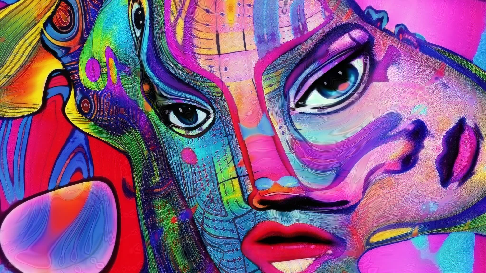

# StyleGAN3 for practice

<p align='center'></p>

[Fourier]-based [StyleGAN3] by Nvidia, slightly adapted for practical use.  
Tested on Python 3.8\~3.9 + PyTorch 1.10\~2.0, requires [FFMPEG] for sequence-to-video conversions. For more explicit details refer to the original implementation.  
NB: If you're not familiar with StyleGAN use, you may want to check the previous [StyleGAN2-ada] repo first.  

## Features
* inference (image generation) in arbitrary resolution
* multi-latent inference with split-frame or masked blending
* examples of translating and rotating animation 
* training with adaptive pseudo augmentation (APA) from [DeceiveD] (active by default)

## Training

* Put your images in `data` as subfolder or zip archive. Ensure they all have the same color channels (monochrome, RGB or RGBA). 
If needed, first crop square fragments from `source` video or directory with images (feasible method, if you work with patterns or shapes, rather than compostions):
```
 multicrop.bat source 512 256 
```
This will cut every source image (or video frame) into 512x512px fragments, overlapped with 256px shift by X and Y. Result will be in directory `source-sub`, rename it as you wish. If you edit the images yourself, ensure their correct size. 

* Train StyleGAN3 with rotational invariance on the prepared dataset `mydata.zip` (in the `data` subfolder) for 8kk iterations:
```
 train.bat r mydata.zip 8000
```
One can set `t` to train StyleGAN3 with translational invariance or `2` to train StyleGAN2, instead of `r`. 

This will run training process, according to the settings in `src/train.py` (check and explore those!!). Results (models and samples) are saved under the `train` directory, similar to original Nvidia approach. 

Please note: we save both compact models (containing only Gs network for inference) as `<dataset>-...pkl` (e.g. `mydata-512-r-0360.pkl`), and full models (containing G/D/Gs networks for further training) as `snapshot-...pkl`. The naming is for convenience only.

If you have troubles with custom cuda ops compilation, try removing their cached version (`C:\Users\eps\AppData\Local\torch_extensions` on Windows).

* Resume training on `mydata.zip` dataset from the last saved model at `train/000-mydata-..` directory:
```
 train_resume.bat r mydata.zip 000-mydata-..  1000
```

* Uptrain (finetune) pre-trained model `stylegan3-r-afhqv2-512x512.pkl` on a new data:
```
 train_resume.bat r newdata.zip stylegan3-r-afhqv2-512x512.pkl 1000
```

## Generation

Run the command below to download few pretrained models from Nvidia or train your own one.
```
python download.py
```

Generated results will be saved as sequences and videos (by default, under `_out` directory).

* Generate custom animation between random latent points (in `z` space):
```
 gen.bat stylegan3-r-ffhq-1024x1024 1920-1080 100-20
```
This will load `stylegan3-r-ffhq-1024x1024.pkl` from `models` directory and make a 1920x1080 px looped video of 100 frames, with interpolation step of 20 frames between keypoints. Please note: omitting `.pkl` extension would load custom network, effectively enabling arbitrary resolution, multi-latent blending, etc. Using filename with extension will load original network from PKL (useful to test foreign downloaded models). There are `--cubic` and `--gauss` options for animation smoothing, and few `--scale_type` choices. Add `--save_lat` option to save all traversed dlatent `w` points as Numpy array in `*.npy` file (useful for the further curation). Set `--seed X` value to produce repeatable results.

* Generate more various imagery:
```
 gen.bat stylegan3-r-ffhq-1024x1024 1920-1080 100-20  -n 2-1 -at -ar -sb 0.5 -sm 0.2
```
This will produce a blended composition of 2 independent frames, animated for both shifts (max 0.2) and rotations, with half-shifted centers of the frames. Argument `--splitfine X` would control the boundary fineness (0 = smoothest). 

* Check & explore other generation options:
```
 python src/_genSGAN3.py --help
```


## Credits

StyleGAN3: 
Copyright © 2021, NVIDIA Corporation & affiliates. All rights reserved.  
Made available under the [Nvidia Source Code License]  

[StyleGAN3]: <https://github.com/NVlabs/stylegan3>
[Fourier]: <https://cdm.link/2022/02/fft-magic-explained-with-animations-and-smoothies-not-equations/>
[FFMPEG]: <https://ffmpeg.org/download.html>
[StyleGAN2-ada]: <https://github.com/eps696/stylegan2ada>
[DeceiveD]: <https://github.com/EndlessSora/DeceiveD>
[Nvidia Source Code License]: <https://github.com/NVlabs/stylegan3/blob/main/LICENSE.txt>
